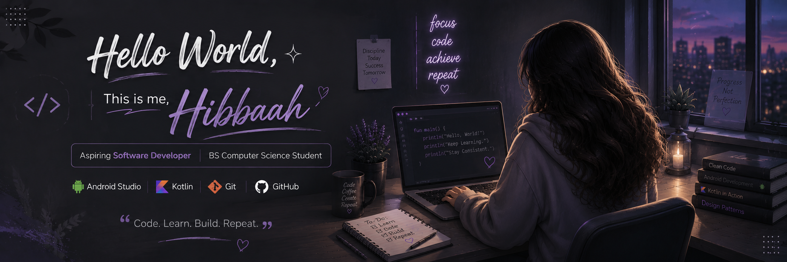

  

<h3>💜 About Me</h3>

🌱 <b>Currently Learning</b>  

&nbsp;

&nbsp;

&nbsp;

🤝 <b>Looking for Help With</b>  

&nbsp;
<b>Android Development</b>

👨‍💻 <b>Projects</b>  

&nbsp;
<a href="https://github.com/h-hibaaah?tab=repositories"><b>h-hibaaah</b></a>

📫 <b>Reach Me</b>  

&nbsp;
<b>hibba5825@gmail.com</b>

⚡ <b>Fun Fact</b>  
💜 I enjoy turning ideas into Projects.

  

<h3 align="left">Connect with me:</h3>

<h3 align="left">Languages and Tools:</h3>

  

  

 

<h3 align="left">GitHub Stats:</h3>

